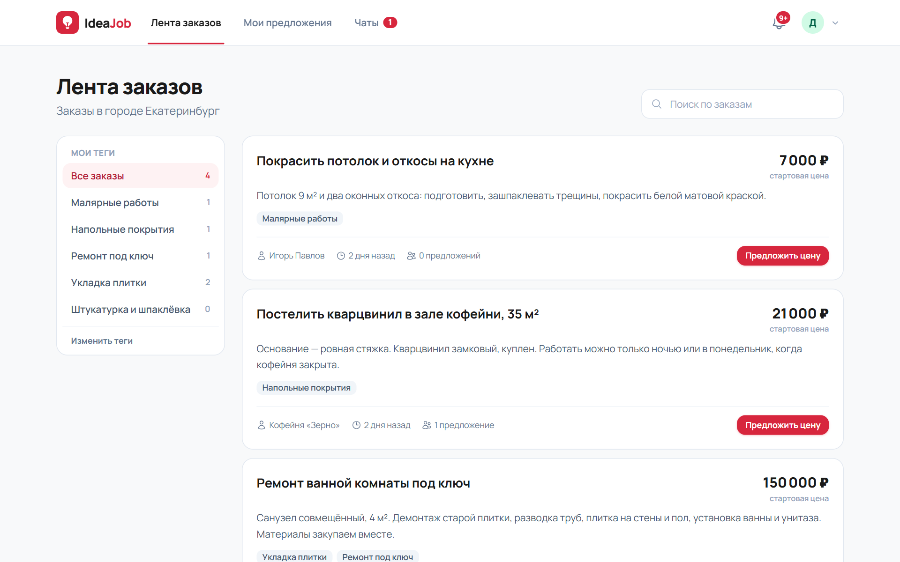
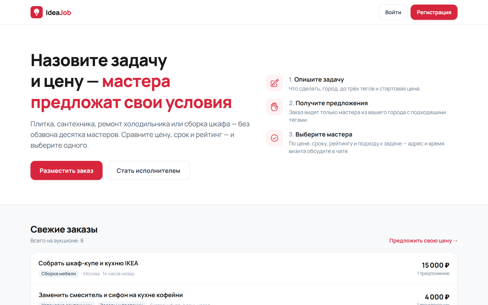
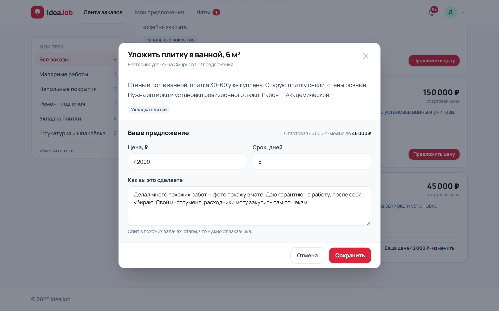
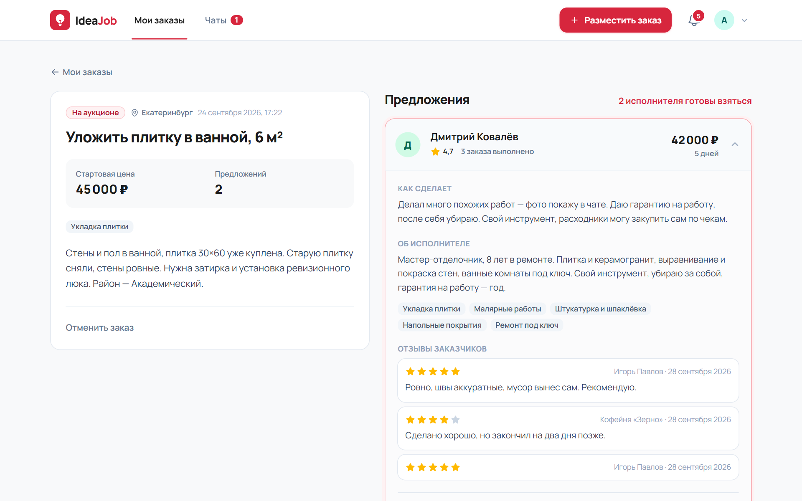
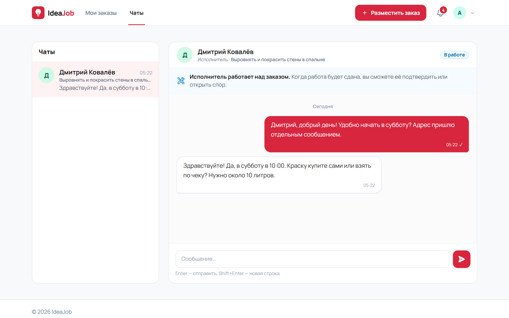
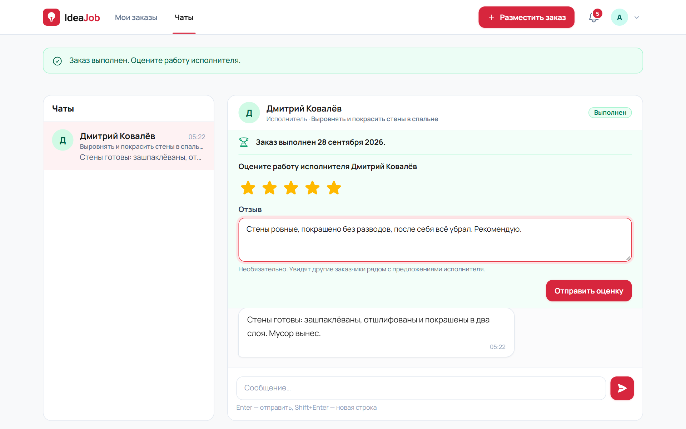
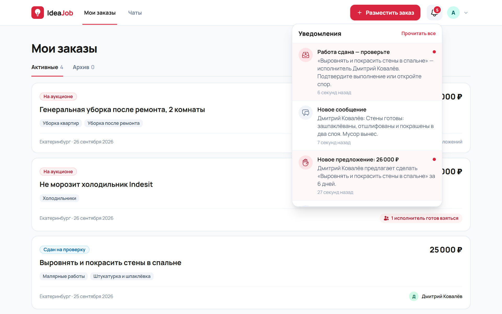
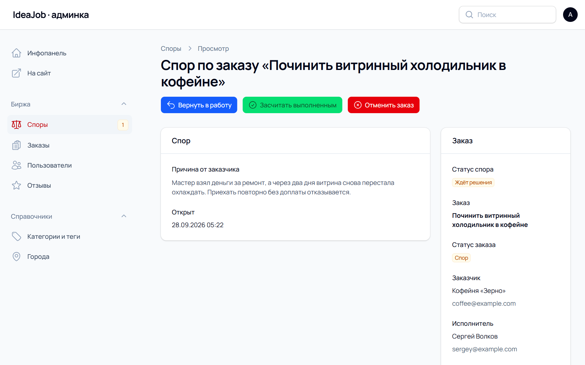
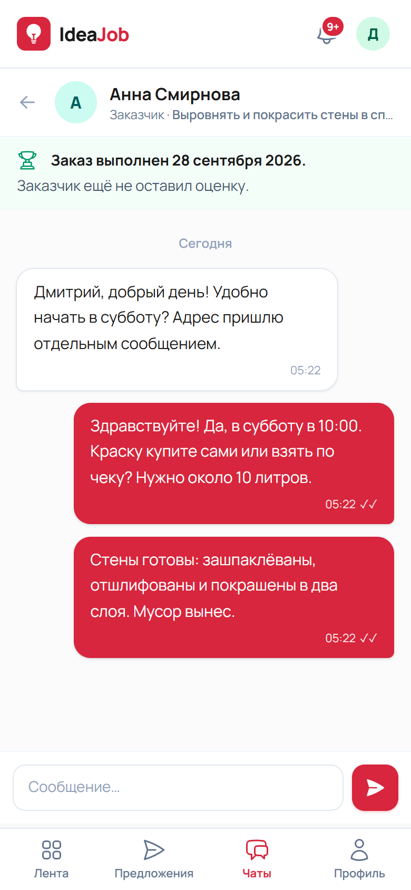

# IdeaJob — биржа мастеров «аукцион наоборот» на Laravel

Биржа очных услуг: уложить плитку, починить холодильник, собрать шкаф, убрать квартиру после ремонта. Заказчик публикует задачу, город и стартовую цену, а мастера сами предлагают свою цену, срок и подход к работе. Заказ видят только мастера из того же города с подходящими тегами. Заказчик сравнивает предложения по цене, сроку и рейтингу, выбирает исполнителя — и дальше они общаются в чате в реальном времени. Работу исполнитель сдаёт через площадку, заказчик подтверждает её или открывает спор, который решает администратор.



## Возможности

**Заказчик**
- Регистрация в одну форму, выбор роли на ней же.
- Создание заказа: название, описание, город (подставляется из прошлого заказа), 1–3 тега из дерева категорий, стартовая цена.
- Список своих заказов: «N исполнителей готовы взяться», вкладки «Активные / Архив».
- Карточка заказа в две колонки: слева задача, справа предложения с ценой, сроком, средним рейтингом и числом выполненных заказов. По клику — подход исполнителя к задаче, его анкета, теги и последние отзывы.
- «Принять исполнителя» — заказ уходит в работу, остальным приходит отказ, открывается чат.
- Подтверждение сданной работы или спор с причиной, оценка исполнителя 1–5 звёзд с отзывом.

**Исполнитель**
- Регистрация с городом, анкетой «о себе» и тегами специализации.
- Лента только заказов из своего города, где совпал хотя бы один тег: фильтр по своим тегам со счётчиками, поиск.
- Предложение в модальном окне: цена (не выше стартовой + 1000 ₽ — проверяется и в браузере, и на сервере), срок, описание подхода. Повторное открытие — правка своего предложения.
- «Мои предложения» с вкладками «Активные / Архив», профиль с отзывами.
- «Сдать работу» в чате.

**Общее**
- Чат 1:1 по заказу: отметки о прочтении, бейдж непрочитанных, новые сообщения без перезагрузки.
- Колокольчик уведомлений: новое предложение, «вас приняли на заказ», «заказ отдан другому», работа сдана и принята, спор открыт и решён, новая оценка. Клик ведёт туда, где нужно действовать.
- Адаптивная вёрстка: на телефоне — нижняя панель вкладок и окно предложения снизу экрана.

**Администратор (Filament)**
- Дерево категорий и тегов: разделы и теги, используемый тег удалить нельзя.
- Справочник городов: город, в котором есть заказы или мастера, удалить нельзя.
- Споры: причина, заказ, принятое предложение и вся переписка из чата. Решения «вернуть в работу», «засчитать выполненным», «отменить заказ» — с комментарием, который получают обе стороны.
- Пользователи с анкетами и тегами, заказы с предложениями, модерация отзывов (удаление пересчитывает рейтинг).

## Стек

Laravel 13 · PHP 8.4 · MySQL 8 · Livewire 4 · Filament 5 · Tailwind CSS 4 · Laravel Reverb + Laravel Echo · Pest 5

## Как устроено

### Аукцион и статусы заказа

```
open ──(заказчик принял предложение)──▶ in_progress ──(исполнитель сдал)──▶ delivered
  │                                          ▲                                 │
  └──(заказчик отменил)──▶ cancelled         │                  ┌──────────────┴──────────────┐
                                             │           (подтвердил)                  (открыл спор)
                                             │                  ▼                             ▼
                                             │             completed ──▶ оценка          disputed
                                             │                                                │
                                             └───────────── вернуть в работу ◀── решение администратора
                                                                              засчитать / отменить ──▶ resolved
```

- Каждый переход — отдельное действие в `app/Actions` (`PlaceBid`, `AcceptBid`, `DeliverOrder`, `ConfirmCompletion`, `OpenDispute`, `ResolveDispute`, `LeaveReview`, `CancelOrder`). Внутри — транзакция с блокировкой строки заказа: два одновременных «Принять исполнителя» или ставка в уже закрытый заказ не проходят.
- Ограничение «не выше стартовой цены + 1000 ₽» проверяется трижды: в браузере (кнопка блокируется), в валидации формы и в самом `PlaceBid` — обойти его запросом в обход формы нельзя.
- Совпадение — scope `Order::matchingExecutor()`: заказ виден исполнителю, если город заказа совпадает с городом в анкете и пересечение тегов не пусто. Работа очная, поэтому без города в анкете лента пуста. Теги — фиксированное дерево из двух уровней, города — справочник; пользователи только выбирают.
- Рейтинг — кэш в анкете исполнителя (`rating_avg`, `reviews_count`, `completed_orders_count`), пересчитывается обсервером при новом или удалённом отзыве. Заказы, закрытые через спор, в рейтинг и счётчик выполненных не входят.

### Реальное время

- Laravel Reverb — WebSocket-сервер, у каждого пользователя приватный канал `user.{id}`.
- Уведомления — стандартные Laravel Notifications: запись в `notifications` (колокольчик) и трансляция в канал через очередь.
- Сообщение чата отправляется в канал сразу, мимо очереди, — задержка воркера в чате заметна.
- Livewire-компоненты слушают канал (`echo-private:…`, `echo-notification:…`) и обновляют только свою часть страницы: переписку, бейджи, список предложений, панель статуса заказа.
- Если WebSocket недоступен, сайт не ломается: сообщение и уведомление сохраняются, ошибка трансляции уходит в лог, чат сам подгружает новые сообщения раз в 5 секунд, колокольчик — раз в минуту.

## Скриншоты

| | |
|---|---|
|  |  |
| Главная: свежие заказы и направления | Предложение: цена не выше стартовой + 1000 ₽ |
|  |  |
| Заказчик сравнивает предложения, рейтинг и отзывы | Чат по заказу с панелью статуса |
|  |  |
| Работа принята — оценка исполнителя | Колокольчик уведомлений |
|  | |
| Разбор спора в админке: переписка и решения | |

<p>
  
  
</p>

## Запуск локально

Нужны PHP 8.4 (расширения `intl`, `pdo_mysql`), Composer, Node.js 20+ и MySQL 8.

```bash
git clone https://github.com/KrisRatman/ExAuctioneJob.git ideajob
cd ideajob
composer install
cp .env.example .env
php artisan key:generate
php artisan reverb:install   # ключи REVERB_* в .env
# в .env: DB_* (MySQL), APP_URL, при желании IDEAJOB_DEMO=true
php artisan migrate --seed
npm install && npm run build
composer run dev             # сервер, очередь, Vite и Reverb одной командой
```

`composer run dev` поднимает `artisan serve`, воркер очереди, Vite и Reverb. Без Reverb сайт тоже работает — без мгновенных обновлений.

### Демо-данные

Сидер создаёт 17 городов, дерево тегов из 9 разделов (ремонт и отделка, сантехника, электрика, ремонт техники, мебель, мастер на час, уборка, переезды, прочее), заказчиков и мастеров в Екатеринбурге и Москве, заказы во всех статусах, чаты с перепиской, историю выполненных заказов с отзывами и открытый спор. Повторный запуск ничего не дублирует.

| Роль | Email | Пароль |
|---|---|---|
| Заказчик | `customer@example.com` | `password` |
| Исполнитель | `executor@example.com` | `password` |
| Администратор (`/admin`) | `admin@example.com` | `password` |

У заказчика и исполнителя есть общий заказ в работе — можно сразу сдать, принять и оценить работу.

С `IDEAJOB_DEMO=true` на странице входа появляются кнопки «Войти как заказчик / исполнитель», а форма входа в админку заполнена.

### Настройки (`.env`)

| Переменная | Что задаёт |
|---|---|
| `IDEAJOB_DEMO` | Демо-стенд: вход в демо-аккаунты одной кнопкой |
| `IDEAJOB_MAX_BID_MARKUP` | На сколько рублей предложение может превышать стартовую цену (по умолчанию 1000) |
| `BROADCAST_CONNECTION` | `reverb` — реальное время, `log` — без WebSocket |
| `REVERB_*`, `VITE_REVERB_*` | Адрес и ключи Reverb для сервера и браузера |

Остальные правила аукциона (лимиты тегов, цены, срока) — в `config/ideajob.php`.

## Тесты

```bash
php artisan test
```

158 тестов Pest, зелёные на SQLite (в памяти) и MySQL:

- регистрация и роли, доступ каждой роли только к своим разделам;
- совпадение города и тегов в ленте, лимит цены «+1000 ₽» (граница и обход формы), правка своего предложения;
- принятие исполнителя: статусы, отклонение остальных, создание чата, повторное принятие и чужие заказы;
- сдача, подтверждение, спор и все три решения администратора;
- оценки: одна на заказ, пересчёт рейтинга, спорные заказы вне статистики, удаление отзыва модератором;
- чат: доступ только участникам, прочтение, одно уведомление на диалог, работа при недоступном Reverb, запасной опрос;
- уведомления и авторизация приватного канала;
- страницы админки и демо-вход.

Ключевые правила (лимит цены, совпадение тегов, «оценка только после выполнения», статистика без спорных заказов) дополнительно проверены мутациями: если убрать проверку из кода, тесты падают.

## Структура

```
app/Actions/            аукцион и жизненный цикл заказа: одно действие — один переход
app/Enums/              роли, статусы заказа, предложения и спора, решения по спору
app/Events/             NewMessage — сообщение чата в канал Reverb
app/Notifications/      уведомления колокольчика (база + трансляция)
app/Livewire/           кабинет заказчика, лента исполнителя, чат, колокольчик, панель статуса заказа
app/Filament/           админка: категории, города, заказы, споры, отзывы, пользователи
config/ideajob.php      правила аукциона
routes/channels.php     приватный канал пользователя
database/seeders/       города, дерево тегов и демо-данные
```
